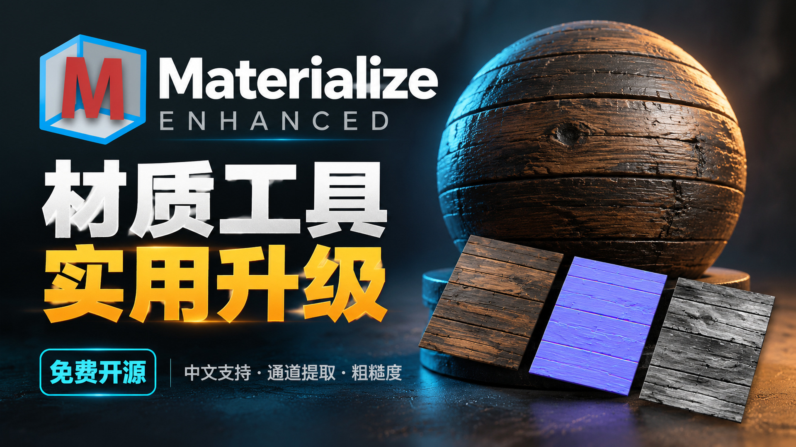

# Materialize Enhanced

Materialize 1.78 enhanced edition maintained by [DannyAnbo](https://github.com/DannyAnbo). Based on [Materialize by Bounding Box Software](https://github.com/BoundingBoxSoftware/Materialize).

**[Download the Windows portable release](https://github.com/DannyAnbo/Materialize-Enhanced/releases/latest)** · [中文使用说明](Enhancements/USER_GUIDE.zh-CN.txt) · [Build instructions](Enhancements/README.md)

## 中文

在原版 Materialize 1.78 基础上改进材质制作工作流。解压 Windows 便携包，运行 `Materialize.exe`，无需另外启动语言切换器。

- 软件内中英文即时切换，保留当前贴图和参数。
- 跨模块撤销/重做，支持导入、清除、来源通道、材质与后处理等修改；参数旁单项恢复默认。
- 拖动图片到对应材质类别导入；每类贴图独立选择整图、R、G、B、A 和反相，适合 ORM 等合并通道。
- `.mtz` 内嵌工作贴图和原始来源；保存项目不额外导出图片。
- Ctrl+N 或按钮新建工程，未保存修改可先保存、放弃或取消；新建会重置工程参数和贴图。
- 增强设置可选默认平滑度/粗糙度，作为软件全局偏好保留，切换工程不改变；导入、预览、属性通道与导出一致。
- 支持中文纹理文件名、文件夹与安装路径，覆盖 PNG/JPG/TGA/BMP/TIFF、分类拖入与旧版外置工程。
- 各贴图显示来源文件名，悬停查看完整名称；名称随工程保存并支持撤销。
- 平铺生成器可切换各类别独立预览，包括粗糙度；边缘衰减、重叠强度和漫反射遮罩参数扩展实际操作范围。
- 有贴图时直接编辑当前贴图，空类别才生成；每类可重新加载导入源，并支持撤销。
- 导出时勾选所需类别，全选/取消全选，属性 RGBA 可单独导出。
- 修复双击工程启动后 Ctrl+N 新建无效。
- 最近打开项目；Ctrl+S 保存、Ctrl+Shift+S 另存；标题栏显示工程名和未保存标记；关闭时提醒保存。
- 统一纹理尺寸：256 至 8192 预设、自定义宽高、恢复原始尺寸。工作贴图、视口和导出使用相同实际尺寸；尺寸设置随工程保存，支持撤销。
- 整理属性贴图 RGBA 面板；关于页面内置维护者头像、Bilibili 与 GitHub 主页。

放大不会新增原图细节。最高尺寸受显卡限制，8K 和多步纹理历史会占用较多内存。JPG 不保存 Alpha。旧版外置贴图工程仍可读取；增强工程建议使用本版本打开。加载另一工程会开始新的撤销历史。

## English

A Windows 1.78 workflow enhancement with live Chinese/English switching, cross-module undo, per-parameter defaults, per-map RGBA source extraction and inversion, drag-and-drop imports, self-contained projects, recent projects, save shortcuts, unsaved-close prompts, project titles, unified texture resolution, Ctrl+N new projects, persistent application-wide smoothness/roughness workflow Unicode texture paths, per-map tiling previews, direct texture editing, source reload and selective exports.

Extract the portable release and run `Materialize.exe`. The texture resolution selector applies to actual working maps, viewport textures and exports. Native sources are retained for later resizing and channel selection. Upscaling cannot add detail.

## Source and building

`Assets/`, `ProjectSettings/` and `UnityPackageManager/` retain the upstream Unity project. The additional implementation and reproducible 1.78 assembly patcher live in [`Enhancements/`](Enhancements/). Opening the upstream Unity project alone does not integrate these runtime enhancements into its scenes; use the documented patch build against the original Windows 1.78 installation.

The original executable uses Unity 2017.4.3; the upstream source project specifies 2017.4.8f1. Existing MonoBehaviour layouts and metadata identities are preserved by the patcher.

## Maintainer and attribution

- Maintainer: [DannyAnbo on GitHub](https://github.com/DannyAnbo) · [Bilibili](https://space.bilibili.com/413324822)
- Original application: Bounding Box Software; original authors and history retained in this fork.
- This modified application and enhancement code are distributed under [GNU GPL version 3](LICENSE), without warranty. Preserve the license and provide corresponding source when redistributing modified builds. See [NOTICE.md](NOTICE.md) for dependencies and avatar attribution.
